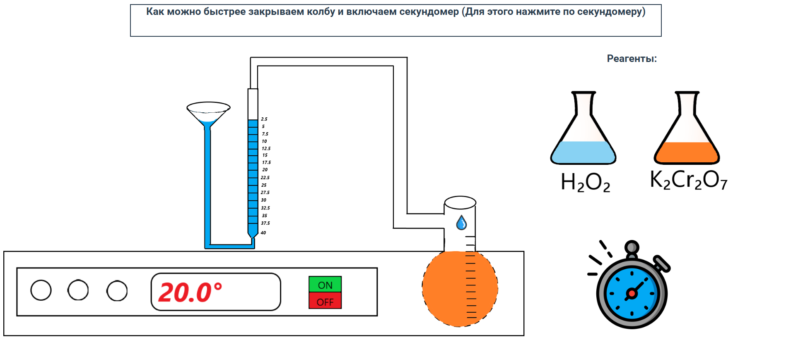
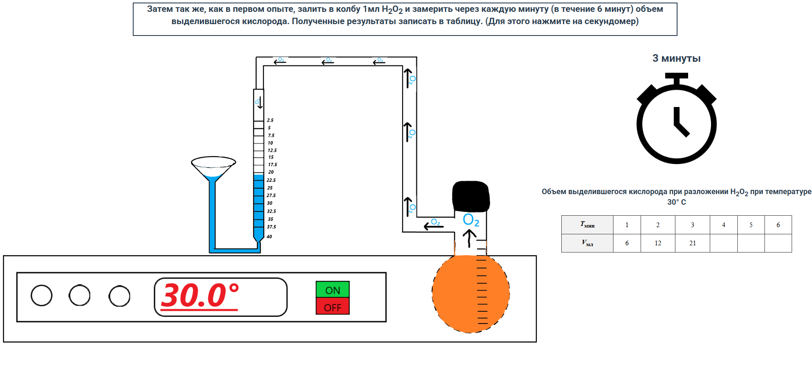
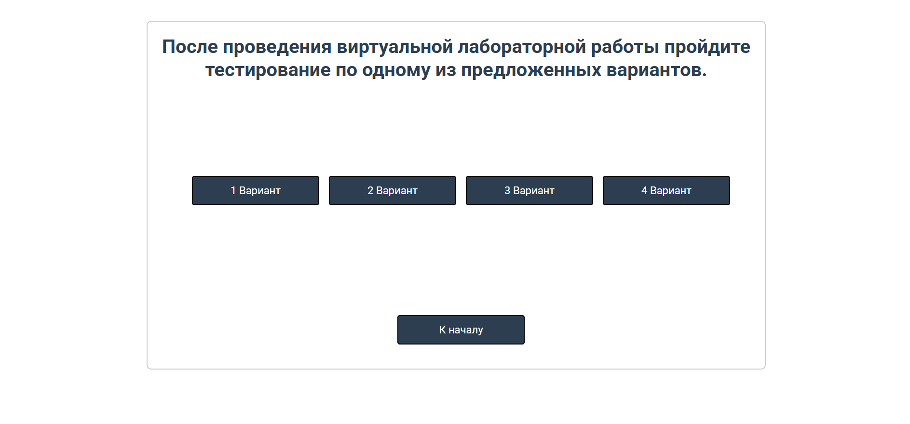
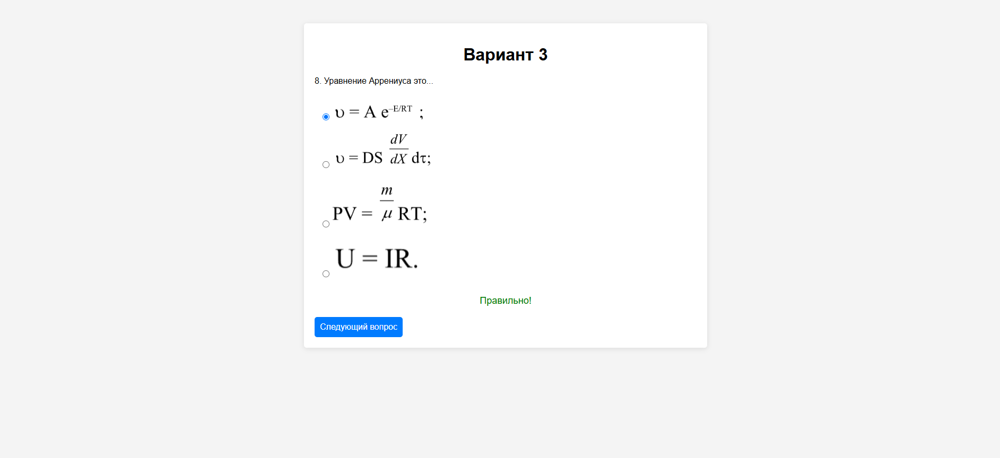
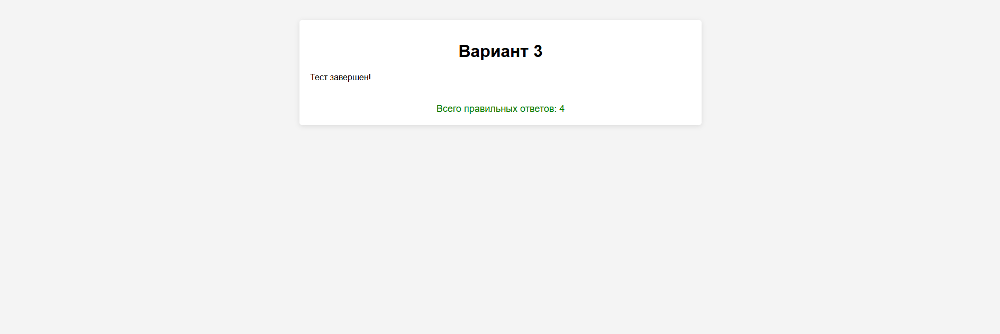

# auto_lab
Автоматизированная виртуальная обучающая лабораторная работа по определению энергии активации каталитического разложения пероксида водорода (V- O2 - Н2О2 - Автовлаб)

# Как запустить программу
перейдите в основную директорию проекта auto_lab-main, после чего нужно зайти в директорию start_app и там найти и запустить файл start.html с помощью любого браузера.

# Пример работы программы

